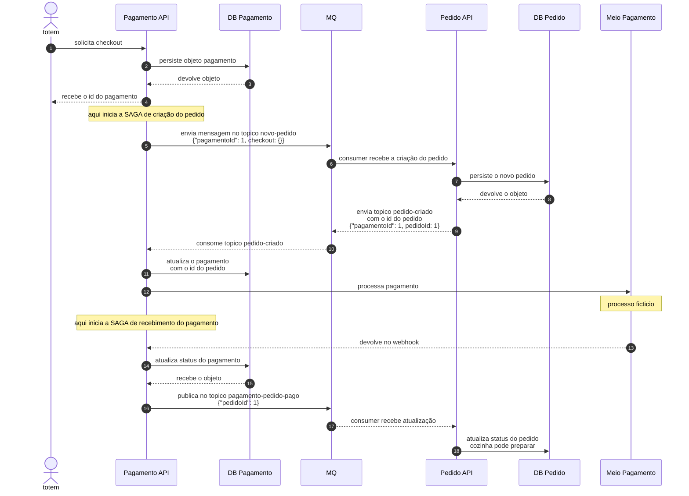
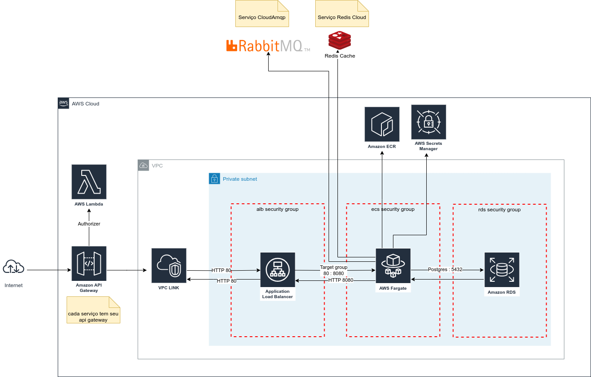
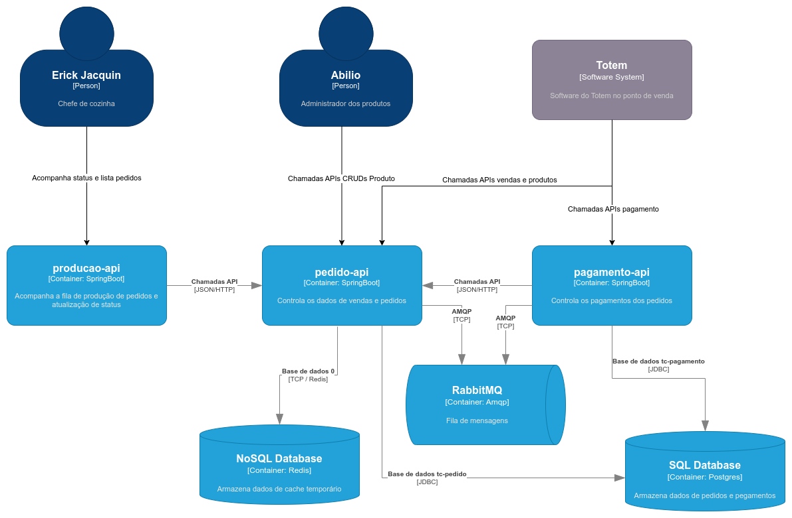

# tc-s1-32-producao-api

Serviço BFF responsável pela exposição dos serviços da API de [Pedidos](https://github.com/tc-s1-32/tc-s1-32-pedido-api).
As principais funcionalidades são:

- Alteração do status do pedido
- Consulta de pedidos

## Sequencia Saga

Escolhemos o padrão **Coreografado** por ser uma sequência de interações entre apenas dois serviços, de forma que ambos podem ter suas ações e contra medidas de forma independente.
O padrão orquestrado implicaria em uma complexidade desnecessária para esse tipo de situação.

## Diagrama Arquitetural da comunicação entre os serviços

## ENTREGÁVEIS:

- [Relatório RIPD](relatorios/ripd/RIPD.pdf)
- [Relatório ZAP Scanning Report](relatorios/owasp_zap/ZAP%20Scanning%20Report%20-%20Fluxos%20solicitados.html)